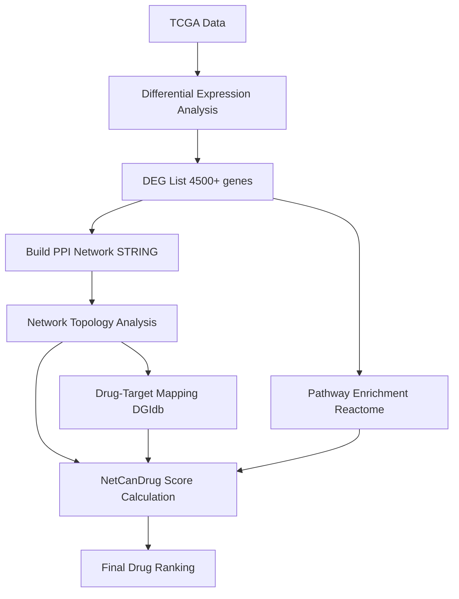

# NetCanDrug

<p align="center">
    
</p>

[](https://opensource.org/licenses/MIT)
[](https://www.python.org/downloads/)
[](https://www.r-project.org/)
[](https://doi.org/10.xxxx/xxxxxx)

**NetCanDrug** é um framework computacional que integra topologia de redes PPI, desregulação de vias biológicas e expressão gênica diferencial para priorização racional de fármacos em câncer.

---

## 🎯 Destaques

- **Framework integrativo** que combina 4 dimensões complementares: topologia de rede, vias biológicas, expressão diferencial e evidências clínicas
- **Código totalmente reprodutível** com dados públicos (TCGA, STRING, DGIdb, Reactome)
- **Pipeline automatizado** com 8 scripts sequenciais em R e Python
- **Validação robusta** contra fármacos aprovados pela FDA
- Framework **extensível** para outros tipos de câncer (33 projetos TCGA disponíveis)

---

## 📊 Metodologia

**NetCanDrug Score** = Integração ponderada de 4 componentes:

| Componente | Peso | Descrição |
|------------|------|-----------|
| **Topology Score (TS)** | 40% | Mede centralidade dos alvos na rede PPI tumoral |
| **Pathway Score (PS)** | 30% | Quantifica impacto em vias desreguladas |
| **Expression Score (ES)** | 20% | Captura magnitude da desregulação dos alvos |
| **Clinical Score (CS)** | 10% | Considera evidências de uso clínico |

**Fórmula:**  
```
NetCanDrug = 0.4×TS + 0.3×PS + 0.2×ES + 0.1×CS
```

Todos os scores são normalizados para [0,1] usando Min-Max scaling.

---

## 🚀 Instalação Rápida

### Pré-requisitos

| Software | Versão Mínima | Propósito |
|----------|---------------|-----------|
| Python | 3.11+ | Scripts de análise |
| R | 4.2.3+ | Análise TCGA e DEA |
| RAM | 8 GB | Manipulação de redes grandes |
| Espaço em disco | 15 GB | Dados TCGA + bancos públicos |

### 1. Clonar o repositório

```bash
git clone https://github.com/JohnPss/NetCanDrug.git
cd NetCanDrug
```

### 2. Criar ambiente virtual Python

```bash
python3 -m venv venv
source venv/bin/activate  # Linux/Mac
# ou
venv\Scripts\activate  # Windows
```

### 3. Instalar dependências Python

```bash
pip install -r requirements.txt
```

**Conteúdo de `requirements.txt`:**
```
networkx==3.5
numpy==2.3.4
pandas==2.3.3
python-igraph==0.11.9
scikit-learn==1.7.2
scipy==1.16.2
statsmodels==0.14.5
tqdm==4.67.1
matplotlib==3.9.0
seaborn==0.13.2
requests==2.32.3
```

### 4. Instalar pacotes R

Abra o R e execute:
```r
# Instalar BiocManager
if (!require("BiocManager", quietly = TRUE))
    install.packages("BiocManager")

# Instalar pacotes Bioconductor
BiocManager::install(c(
    "TCGAbiolinks",
    "SummarizedExperiment",
    "edgeR",
    "biomaRt"
))

# Instalar pacotes CRAN
install.packages(c("dplyr", "rstudioapi"))
```

---

## 📁 Estrutura do Projeto

```
NetCanDrug/
├── README.md                   # Este arquivo
├── LICENSE                     # Licença MIT
├── requirements.txt            # Dependências Python
├── run_pipeline.sh             # Script para executar pipeline completo
├── config.py                   # Configurações centralizadas
│
├── src/                        # Código-fonte
│   ├── pipeline/               # Scripts do pipeline principal
│   │   ├── 01_prepare_tcga_data.R          # Download e preparação TCGA
│   │   ├── 02_differential_expression.R    # Análise de expressão diferencial
│   │   ├── 03_build_tumor_network.py       # Construção da rede PPI
│   │   ├── 04_analyze_tumor_topology.py    # Análise topológica
│   │   ├── 05_process_dgidb.py             # Mapeamento droga-alvo
│   │   ├── 06_create_id_map.R              # Conversão UniProt↔Gene
│   │   ├── 07_pathway_enrichment.py        # Enriquecimento de vias
│   │   └── 08_calculate_netcandrug_score.py # Cálculo do score final
│   │
│   ├── validation/             # Scripts de validação
│   │   └── 09_full_validation.py
│   │
│   └── plotting/               # Scripts de visualização
│       ├── plot_survival.py
│       └── beautiful_km.R
│
├── data/                       # Diretório de dados (não versionado)
│   ├── raw/                    # Dados brutos
│   │   ├── string_links.txt
│   │   ├── 9606.protein.aliases.v12.0.txt
│   │   ├── interactions.tsv
│   │   ├── UniProt2Reactome.txt
│   │   ├── reactome_gene_pathway_map.csv
│   │   └── GDCdata/            # Dados TCGA (baixados automaticamente)
│   │
│   ├── processed/              # Resultados intermediários
│   │   ├── tcga_brca_prepared_counts.RData
│   │   ├── deg_list.csv
│   │   ├── ppi_tumor_network.graphml
│   │   ├── tumor_network_topology.csv
│   │   ├── drug_target_mapping.csv
│   │   ├── uniprot_to_genesymbol.csv
│   │   ├── dysregulated_pathways.csv
│   │   └── final_drug_ranking.csv
│   │
│   └── reference/              # Dados de referência
│       └── fda_breast_cancer_drugs.csv
│
└── results/                    # Resultados de validação e figuras
    ├── validation_fda_results.csv
    ├── baseline_comparisons.csv
    └── figures/
```

---

## 📖 Como Usar

### Opção 1: Pipeline Completo Automatizado

```bash
# Tornar o script executável
chmod +x run_pipeline.sh

# Executar todo o pipeline (tempo estimado: 2-3 horas)
./run_pipeline.sh
```

### Opção 2: Executar Scripts Manualmente

#### **Passo 1: Preparar dados TCGA**
```bash
Rscript src/pipeline/01_prepare_tcga_data.R
```
- **Entrada:** Nenhuma (baixa do GDC automaticamente)
- **Saída:** `data/processed/tcga_brca_prepared_counts.RData`
- **Tempo:** ~30-60 min (depende da conexão)

#### **Passo 2: Análise de Expressão Diferencial**
```bash
Rscript src/pipeline/02_differential_expression.R
```
- **Entrada:** `tcga_brca_prepared_counts.RData`
- **Saída:** `data/processed/deg_list.csv` (~4.500 DEGs)
- **Critérios:** FDR < 0.01, |logFC| > 1.5

#### **Passo 3: Construir Rede Tumoral**
```bash
python src/pipeline/03_build_tumor_network.py
```
- **Entrada:** DEGs + STRING database
- **Saída:** `ppi_tumor_network.graphml` (~1.800 nós, ~10.000 arestas)
- **Filtro:** STRING score ≥ 700

#### **Passo 4: Analisar Topologia**
```bash
python src/pipeline/04_analyze_tumor_topology.py
```
- **Métricas calculadas:** Degree, Betweenness, Closeness
- **Saída:** `tumor_network_topology.csv`

#### **Passo 5: Mapear Drogas-Alvos**
```bash
python src/pipeline/05_process_dgidb.py
```
- **Filtros:** Apenas FDA-approved + alvos na rede
- **Saída:** `drug_target_mapping.csv` (~1.800 drogas)

#### **Passo 6: Criar Mapa de IDs**
```bash
Rscript src/pipeline/06_create_id_map.R
```
- **Usa:** biomaRt (Ensembl)
- **Saída:** `uniprot_to_genesymbol.csv`

#### **Passo 7: Enriquecimento de Vias**
```bash
python src/pipeline/07_pathway_enrichment.py
```
- **Método:** Teste hipergeométrico + correção FDR
- **Saída:** `dysregulated_pathways.csv` (~100-250 vias)

#### **Passo 8: Calcular NetCanDrug Score**
```bash
python src/pipeline/08_calculate_netcandrug_score.py
```
- **Integra:** Topologia + Vias + Expressão + Clínico
- **Saída:** `final_drug_ranking.csv` (ranking completo)

---

## 📊 Arquivos de Saída Principais

### `final_drug_ranking.csv`
Ranking completo de todos os fármacos analisados.

| Coluna | Descrição |
|--------|-----------|
| `drug_name` | Nome do fármaco |
| `NetCanDrug_Score` | Score composto final (0-1) |
| `num_targets` | Número de alvos na rede tumoral |
| `ts_norm` | Topology Score normalizado |
| `ps_norm` | Pathway Score normalizado |
| `es_norm` | Expression Score normalizado |
| `cs_norm` | Clinical Score normalizado |

**Exemplo:**
```csv
drug_name,NetCanDrug_Score,num_targets,ts_norm,ps_norm,es_norm,cs_norm
TESTOSTERONE,0.604,13,0.473,0.942,0.280,1.0
DOXORUBICIN,0.583,23,0.380,1.000,0.238,1.0
FENOFIBRATE,0.572,8,0.915,0.365,0.283,1.0
```

### `tumor_network_topology.csv`
Métricas topológicas de cada proteína na rede.

| Coluna | Descrição |
|--------|-----------|
| `gene_symbol` | Símbolo do gene |
| `degree` | Número de conexões |
| `betweenness_centrality` | Centralidade de intermediação |
| `closeness_centrality` | Centralidade de proximidade |
| `logFC` | Log2 fold-change (tumor vs. normal) |
| `FDR` | False Discovery Rate |

### `dysregulated_pathways.csv`
Vias biológicas significativamente alteradas.

| Coluna | Descrição |
|--------|-----------|
| `pathway_name` | Nome da via Reactome |
| `FDR` | False Discovery Rate |
| `degs_in_pathway` | Número de DEGs na via |
| `genes_in_pathway` | Tamanho total da via |

---

## 🧪 Validação e Reprodutibilidade

### Executar Validação Completa

```bash
python src/validation/09_full_validation.py
```

**Análises incluídas:**
1. ✅ Recuperação de fármacos FDA-approved (curva ROC)
2. ✅ Comparação com baselines (expressão isolada, topologia isolada, random)
3. ✅ Testes de permutação (1.000 iterações)
4. ✅ Análise de enriquecimento vs. ranking aleatório
5. ✅ Precision@k e Recall@k

**Saídas:**
- `results/validation_fda_results.csv`
- `results/baseline_comparisons.csv`
- `results/permutation_tests.csv`

---

## 🔧 Configuração Avançada

### Editar Parâmetros em `config.py`

```python
# Thresholds de filtro
STRING_SCORE_THRESHOLD = 700        # Confiança mínima STRING (0-1000)
PATHWAY_FDR_THRESHOLD = 0.05        # Significância de vias

# Pesos do NetCanDrug Score
SCORE_WEIGHTS = {
    'topology': 0.4,
    'pathway': 0.3,
    'expression': 0.2,
    'clinical': 0.1
}

# Critérios de DEA
DEA_FDR_THRESHOLD = 0.01
DEA_LOGFC_THRESHOLD = 1.5
```

### Adaptar para Outro Tipo de Câncer

**Edite `src/pipeline/01_prepare_tcga_data.R`:**
```r
# Linha 59: trocar projeto TCGA
query_brca <- GDCquery(
  project = "TCGA-LUAD",  # Era "TCGA-BRCA", agora Lung Adenocarcinoma
  data.category = "Transcriptome Profiling",
  data.type = "Gene Expression Quantification",
  workflow.type = "STAR - Counts",
  sample.type = c("Primary Tumor", "Solid Tissue Normal")
)
```

**Projetos TCGA disponíveis:**
- `TCGA-BRCA` — Breast Cancer (mama)
- `TCGA-LUAD` — Lung Adenocarcinoma (pulmão)
- `TCGA-COAD` — Colon Adenocarcinoma (cólon)
- `TCGA-PRAD` — Prostate Adenocarcinoma (próstata)
- `TCGA-LIHC` — Liver Hepatocellular Carcinoma (fígado)
- `TCGA-GBM` — Glioblastoma Multiforme (cérebro)
- [Ver lista completa](https://portal.gdc.cancer.gov/projects?filters=%7B%22op%22%3A%22and%22%2C%22content%22%3A%5B%7B%22op%22%3A%22in%22%2C%22content%22%3A%7B%22field%22%3A%22projects.program.name%22%2C%22value%22%3A%5B%22TCGA%22%5D%7D%7D%5D%7D)

---

## 📥 Download de Dados Externos

Antes de executar o pipeline, baixe os seguintes arquivos:

### 1. STRING Database (Interações PPI)

```bash
cd data/raw

# Baixar interações proteína-proteína (Homo sapiens)
wget https://stringdb-downloads.org/download/protein.links.v12.0/9606.protein.links.v12.0.txt.gz
gunzip 9606.protein.links.v12.0.txt.gz
mv 9606.protein.links.v12.0.txt string_links.txt

# Baixar aliases de proteínas
wget https://stringdb-downloads.org/download/protein.aliases.v12.0/9606.protein.aliases.v12.0.txt.gz
gunzip 9606.protein.aliases.v12.0.txt.gz
```

**Alternativa:** Acesse manualmente [STRING Downloads](https://string-db.org/cgi/download)

### 2. DGIdb (Interações Droga-Gene)

**Opção A: Usar script automático** (recomendado)
```bash
python download_dgidb.py
```

**Opção B: Download manual**
```bash
cd data/raw
wget https://www.dgidb.org/data/monthly_tsvs/2024-Jan/interactions.tsv
```

### 3. Reactome (Anotações de Vias)

```bash
cd data/raw

# Baixar mapeamento UniProt → Reactome
wget https://reactome.org/download/current/UniProt2Reactome.txt

# Processar para formato necessário
python process_reactome.py
```

**Isso criará:** `data/raw/reactome_gene_pathway_map.csv`

### 4. TCGA (Dados de Expressão)

✅ **Não precisa baixar manualmente!**  
O Script 01 baixa automaticamente via `TCGAbiolinks`.

---

## 📚 Citação

Se você usar este código em sua pesquisa, **por favor cite:**

```bibtex
@article{siqueira2025netcandrug,
  title={NetCanDrug: A Network-Based Approach for Drug Repositioning in Cancer},
  author={Siqueira, João Pedro Silva and Romualdo, João Vitor Lobato},
  journal={Journal Name},
  year={2025},
  volume={X},
  pages={XXX-XXX},
  doi={10.xxxx/xxxxxx},
  note={GitHub: https://github.com/JohnPss/NetCanDrug}
}
```

**Cite também os bancos de dados utilizados:**

- **TCGA:** Cancer Genome Atlas Research Network. *Nature* 2012. doi:10.1038/nature11412
- **STRING:** Szklarczyk et al. *Nucleic Acids Res* 2023. doi:10.1093/nar/gkac1000
- **DGIdb:** Freshour et al. *Nucleic Acids Res* 2021. doi:10.1093/nar/gkaa1084
- **Reactome:** Gillespie et al. *Nucleic Acids Res* 2022. doi:10.1093/nar/gkab1028

---

## 🤝 Contribuindo

Contribuições são bem-vindas! Para contribuir:

1. **Fork** este repositório
2. Crie uma **branch** para sua feature (`git checkout -b feature/NovaFuncionalidade`)
3. **Commit** suas mudanças (`git commit -m 'Adiciona nova funcionalidade'`)
4. **Push** para a branch (`git push origin feature/NovaFuncionalidade`)
5. Abra um **Pull Request**

**Áreas de interesse:**
- Validação externa em outras coortes (METABRIC, SCAN-B)
- Análise estratificada por subtipo molecular
- Extensão pan-câncer (33 projetos TCGA)
- Priorização de combinações farmacológicas
- Interface web para consulta de resultados

---

## 📧 Contato

**Autores:**
- **João Pedro Silva Siqueira** — [joaopedrosilvasiqueira1@gmail.com](mailto:joaopedrosilvasiqueira1@gmail.com)
- **João Vitor Lobato Romualdo** — [joaovitorlobatoromualdo16@gmail.com](mailto:joaovitorlobatoromualdo16@gmail.com)

**Afiliação:**  
Centro Federal de Educação Tecnológica de Minas Gerais (CEFET-MG)  
Campus V – Divinópolis, Brasil

**GitHub Issues:** [https://github.com/JohnPss/NetCanDrug/issues](https://github.com/JohnPss/NetCanDrug/issues)

---

## 📜 Licença

Este projeto está licenciado sob a **MIT License** - veja o arquivo [LICENSE](LICENSE) para detalhes.

**Resumo da licença:**
- ✅ Uso comercial permitido
- ✅ Modificação permitida
- ✅ Distribuição permitida
- ✅ Uso privado permitido
- ⚠️ Sem garantias (software fornecido "como está")
- 📄 Deve incluir aviso de copyright e licença

---

## 🙏 Agradecimentos

Este trabalho foi possível graças aos seguintes recursos públicos:

- **TCGA Research Network** — pela disponibilização aberta de dados genômicos
- **STRING Consortium** — pelo banco curado de interações PPI
- **DGIdb Team** — pelas interações droga-gene
- **Reactome Team** — pelas anotações de vias biológicas
- **Bioconductor Community** — pelos pacotes de análise genômica
- **NetworkX/igraph developers** — pelas ferramentas de análise de redes

---

## 🔬 Metodologia Detalhada

### Pipeline Overview



### Componentes do NetCanDrug Score

#### 1. Topology Score (TS)
Mede a importância dos alvos na rede PPI tumoral.

**Fórmula:**
```
TS(drug) = Σ [degree(target_i) × betweenness(target_i)] / num_targets
```

**Normalizado por Min-Max scaling.**

#### 2. Pathway Score (PS)
Quantifica impacto em vias desreguladas.

**Fórmula:**
```
PS(drug) = Σ [1 / FDR(pathway_j)] para vias impactadas
```

**Onde:** pathway_j contém ≥ 1 alvo do fármaco.

#### 3. Expression Score (ES)
Captura magnitude da desregulação dos alvos.

**Fórmula:**
```
ES(drug) = Σ |logFC(target_i)| / num_targets
```

#### 4. Clinical Score (CS)
Considera evidências de uso clínico prévio.

**Critérios:**
- CS = 1.0 se fármaco já usado em oncologia
- CS = 0.5 se aprovado para outras indicações
- CS = 0.0 se apenas experimental

---

## 📊 Estatísticas do Dataset

### TCGA-BRCA (Breast Cancer)

| Métrica | Valor |
|---------|-------|
| Total de amostras | 1.215 |
| Amostras tumorais | 1.104 |
| Amostras normais | 111 |
| Genes analisados | 60.660 (Ensembl) |
| DEGs identificados (FDR<0.01, \|logFC\|>1.5) | ~4.500 |

### Rede PPI Tumoral

| Métrica | Valor |
|---------|-------|
| Nós (proteínas) | 1.826 |
| Arestas (interações) | 10.022 |
| Grau médio | 10.98 |
| Maior hub (CDK1) | 134 conexões |
| Componentes conectados | 1 (giant component) |

### Mapeamento Droga-Alvo

| Métrica | Valor |
|---------|-------|
| Drogas FDA-approved mapeadas | 1.778 |
| Alvos únicos na rede | 578 |
| Interações droga-alvo | 5.406 |
| Média de alvos por droga | 3.04 |

### Vias Reactome

| Métrica | Valor |
|---------|-------|
| Vias significativas (FDR<0.05) | 96-104 |
| Via mais significativa | Classical antibody-mediated complement activation |
| Menor FDR observado | ~10^-36 |

---

## ❓ FAQ (Perguntas Frequentes)

<details>
<summary><b>Quanto tempo leva para executar o pipeline completo?</b></summary>

**Tempo estimado: 2-3 horas** em um laptop padrão (8GB RAM, i5/i7).

- Script 01 (download TCGA): 30-60 min
- Script 02 (DEA): 5-10 min
- Scripts 03-08: 30-60 min total
</details>

<details>
<summary><b>Posso executar em outros tipos de câncer além de mama?</b></summary>

**Sim!** Basta editar o projeto TCGA no Script 01.

Exemplo para câncer de pulmão:
```r
project = "TCGA-LUAD"  # ao invés de "TCGA-BRCA"
```

Veja lista completa de projetos [aqui](https://portal.gdc.cancer.gov/projects).
</details>

<details>
<summary><b>Como interpretar o NetCanDrug Score?</b></summary>

- **0.8-1.0:** Candidatos muito promissores
- **0.6-0.8:** Candidatos promissores
- **0.4-0.6:** Candidatos moderados
- **<0.4:** Baixa prioridade

**Nota:** Sempre considere os 4 scores individuais (TS, PS, ES, CS) para entender por que um fármaco foi priorizado.
</details>

<details>
<summary><b>Os resultados já foram validados experimentalmente?</b></summary>

Este é um estudo **in silico** (computacional). Validação experimental (in vitro/in vivo) é necessária antes de qualquer aplicação clínica.

No entanto, o pipeline foi validado contra:
- ✅ Fármacos já aprovados pela FDA para câncer de mama
- ✅ Literatura científica (PubMed)
- ✅ Ensaios clínicos (ClinicalTrials.gov)
</details>

<details>
<summary><b>Posso usar este código comercialmente?</b></summary>

**Sim**, a licença MIT permite uso comercial. No entanto:
- Inclua o aviso de copyright
- Cite o trabalho original
- Sem garantias (use por sua conta e risco)
</details>

---

## 🗺️ Roadmap

### Versão 2.0 (Planejada)

- [ ] **Interface web** para consulta de resultados
- [ ] **Análise estratificada** por subtipo molecular (Luminal A/B, HER2+, Triple-negative)
- [ ] **Validação externa** em METABRIC e SCAN-B
- [ ] **Extensão pan-câncer** para todos os 33 projetos TCGA
- [ ] **Priorização de combinações** farmacológicas (drug synergy)
- [ ] **Análise de sobrevida** estratificada por fármaco
- [ ] **API REST** para integração com outras ferramentas

### Versão 3.0 (Futuro)

- [ ] Incorporar **variantes genômicas** (mutações, CNVs)
- [ ] Integrar **dados de transcriptoma single-cell**
- [ ] **Machine learning** para refinar pesos do score
- [ ] **Análise de resistência** a fármacos

---

## 📈 Changelog

### v1.0.0 (2025-12-12)
- ✨ Release inicial
- ✅ Pipeline completo funcional (8 scripts)
- ✅ Validação contra fármacos FDA
- ✅ Documentação completa
- ✅ Dados de exemplo (TCGA-BRCA)

---

**⭐ Se este projeto foi útil, considere dar uma estrela no GitHub!**